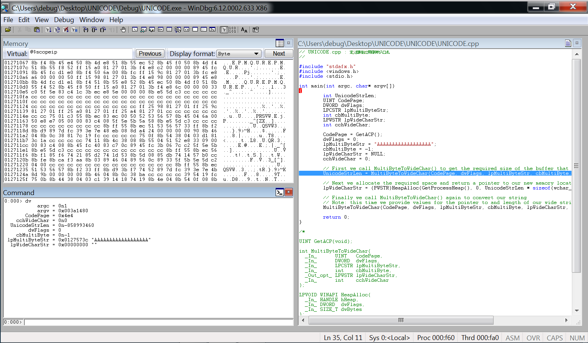
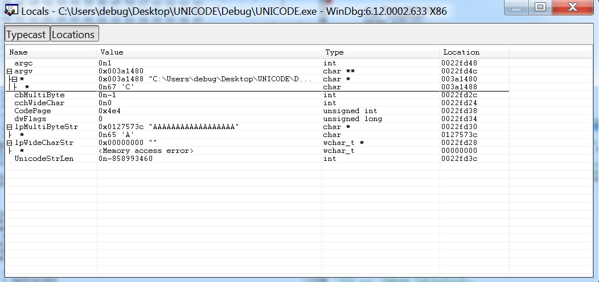

## dv (Display Local Variables)

The dv command displays the names and values of all local variables in the current scope.

```
0:000> dv
           argc = 0n1
           argv = 0x003a1480
       CodePage = 0x4e4
    cchWideChar = 0n0
  UnicodeStrLen = 0n-858993460
        dwFlags = 0
    cbMultiByte = 0n-1
 lpMultiByteStr = 0x0127573c "AAAAAAAAAAAAAAAAAA"
  lpWideCharStr = 0x00000000 ""

0:000> dv /V
0022fd48 @ebp+0x08            argc = 0n1
0022fd4c @ebp+0x0c            argv = 0x003a1480
0022fd38 @ebp-0x08        CodePage = 0x4e4
0022fd24 @ebp-0x1c     cchWideChar = 0n0
0022fd3c @ebp-0x04   UnicodeStrLen = 0n-858993460
0022fd34 @ebp-0x0c         dwFlags = 0
0022fd2c @ebp-0x14     cbMultiByte = 0n-1
0022fd30 @ebp-0x10  lpMultiByteStr = 0x0127573c "AAAAAAAAAAAAAAAAAA"
0022fd28 @ebp-0x18   lpWideCharStr = 0x00000000 ""

0:000> dv /i
prv param             argc = 0n1
prv param             argv = 0x003a1480
prv local         CodePage = 0x4e4
prv local      cchWideChar = 0n0
prv local    UnicodeStrLen = 0n-858993460
prv local          dwFlags = 0
prv local      cbMultiByte = 0n-1
prv local   lpMultiByteStr = 0x0127573c "AAAAAAAAAAAAAAAAAA"
prv local    lpWideCharStr = 0x00000000 ""

```






## References

- https://docs.microsoft.com/en-us/windows-hardware/drivers/debugger/locals-window
- https://docs.microsoft.com/en-us/windows-hardware/drivers/debugger/dv--display-local-variables-